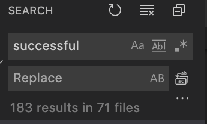

Have you has to change a string data somewhere in you code then had to change in several other files ?



What is a Primitive data type ?

This are just basic data type of the programming laguage e.g `string`, `int`, `bool`.

We can also add `bytes`. `float`, `double` etc,

Hence `primitive obsession` is when alot of primitive data types are littered around in your code Just like the picture above


```jsx

// Bad Code
if(status == "pending"){
    // Do Something
}

// Good Code
var STATUS_PENDING = "pending";

if(status == STATUS_PENDING){
    // Do Something
}

```

We can go futhur and put all the variables for of the primitives data in a seperate file and declare them as constants in a class
but also remember to seperate the classes according to their relationship, so all related primitive data that has to do with the same functionality would be in the same class as not to cause tight coupling of constants

```jsx

// status.js

class BitcoinPremitives
{

    const PENDING_BITCOIN_TRANSACTION = "pending";
    const SUCCESSFUL_BITCOIN_TRANSACTION = "successful";

    const IS_INTERNAL_TRANSACTION = true;
    const IS_NOT_INTERNAL_TRANSACTION = false;

}

// when it is used
if(transaction == BitcoinPremitives.PENDING_BITCOIN_TRANSACTION)
{
    transaction.is_internal = BitcoinPremitives.IS_INTERNAL_TRANSACTION
}

```

so you can have classes like this to reduce primitive obssessions, when using MVC architecture instead of making classes you can
put those constanst inside of the models.

Here is an example in LARAVEL

```jsx

// BitcoinTransaction.php

class BitcoinTransaction extends models
{
    const PENDING_BITCOIN_TRANSACTION = "pending";
    const SUCCESSFUL_BITCOIN_TRANSACTION = "successful";

    const IS_INTERNAL_TRANSACTION = true;
    const IS_NOT_INTERNAL_TRANSACTION = false;

    $fillable = ['amount', 'is_internal'];

    $protected = ['transaction_id', 'id'];

    // ...
}

```

Something i found very useful about this, is that you limit the amount of primitive you pass as `Dependency Injection`, this kind of decouples your code from a primitive that can change anytime.

```jsx

// UserAction.php

// method that requires a string signature
public function createUser(string $userType){
    // do something
}

//GOOD PRACTICE

// using the method
$this->createUser( User::ADMIN_USER );


//BAD PRACTICE

// using the method
$this->createUser( "admin" );

```

using the method will greatly increase the orginazation of your work and prevent hard coding primitive to an instance

So, always handle your primitives well.